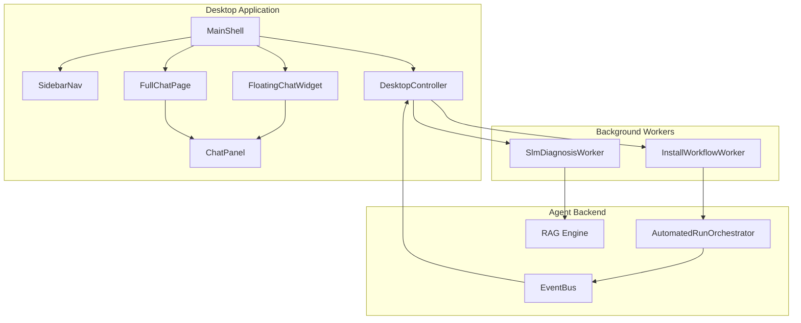

# Architecture

## System Diagram

## Layer Responsibilities

### UI Layer (`src/smartinstall/ui/`)

| Module | Responsibility |
|--------|----------------|
| `shell/` | Application chrome — MainShell, sidebar, header, floating chat, splash |
| `pages/` | Full-page views — dashboard, monitoring, troubleshooting, full chat |
| `components/` | Reusable UI building blocks — cards, buttons, visualizers |
| `widgets/` | Complex widgets — ChatPanel, avatars |
| `controllers/` | UI orchestration — DesktopController |
| `services/` | UI-specific logic — formatters, parsers, stats |
| `workers/` | QThread wrappers for long-running tasks |
| `bridge/` | EventBus → Qt signal bridge |
| `theme/` | CCTech design tokens and global QSS |
| `resources/` | Icons, brand asset loading |

### Agent Layer (`src/smartinstall/agent/`)

Installation orchestration, collectors, session management, SLM/RAG engine, configuration.

### Core Layer (`src/smartinstall/core/`)

Shared Pydantic models, enums, and result types used by both UI and agent.

## Chat Architecture

A **single shared `ChatPanel`** instance is reparented between:

1. **FloatingChatWidget** — Bottom-right overlay (compact 400×540 or maximized 680×720)
2. **FullChatPage** — Full-page workspace via sidebar navigation

This ensures message history persists when switching between modes.

## Event Flow

1. User submits chat command → DesktopController
2. Controller starts InstallWorkflowWorker or handles list/browse
3. EventBus emits status updates → QtEventBridge → chat + monitoring
4. On completion → ChatFormatter builds rich messages → optional SLM diagnosis

## Configuration

Primary config: `config/smartinstall.config.json`

Resolved via `SmartInstallConfig` in `agent/infrastructure/config_provider.py`.
