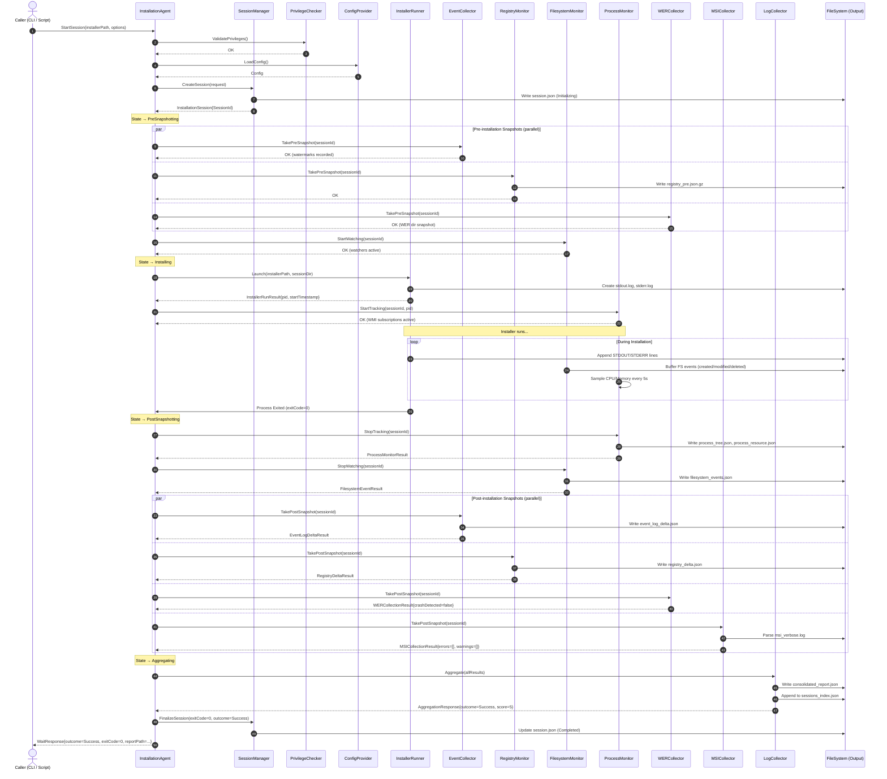
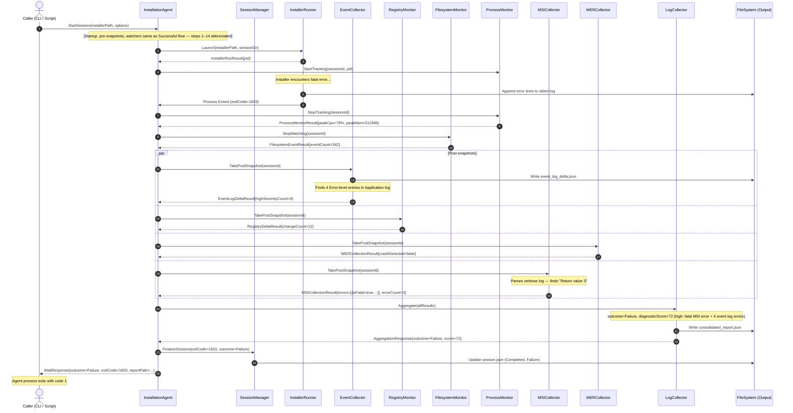
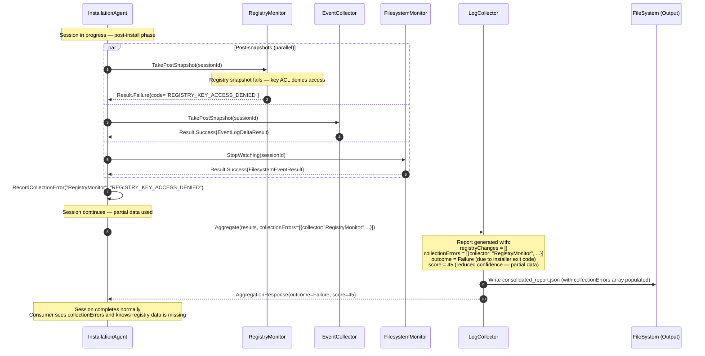

# Sequence Diagrams
## SmartInstall AI — Installation Agent & Log Collection Layer
**Version:** 1.0  
**Date:** 2026-06-01  
**Status:** Draft  

---

## 1. Successful Installation Flow



---

## 2. Failed Installation Flow



---

## 3. MSI-Specific Failure Flow

```mermaid
sequenceDiagram
    autonumber
    actor Caller
    participant Agent as InstallationAgent
    participant IR as InstallerRunner
    participant MSI as MSICollector
    participant EC as EventCollector
    participant WER as WERCollector
    participant LC as LogCollector
    participant FS as FileSystem (Output)

    Caller->>Agent: StartSession(installerPath="setup.msi", type=MSI)

    Note over Agent: Pre-snapshots taken (abbreviated)

    Agent->>MSI: GetMsiLogPath(sessionId)
    MSI-->>Agent: "<sessionDir>\msi_verbose.log"

    Agent->>IR: Launch("msiexec.exe /i setup.msi /l*v <logPath> /qn /norestart")
    IR-->>Agent: InstallerRunResult{pid=4832}

    Note over IR: msiexec begins installation actions...

    IR->>FS: msi_verbose.log grows line by line
    IR->>FS: STDOUT captures msiexec progress

    Note over IR: Action "InstallFiles" fails — returns value 3

    IR->>Agent: Process Exited (exitCode=1603)

    Agent->>MSI: TakePostSnapshot(sessionId)
    MSI->>FS: Read msi_verbose.log (full parse)

    Note over MSI: Regex scan finds:<br/>- "Return value 3" at line 2847<br/>- 2 ERROR lines preceding it<br/>- 1 WARNING line

    MSI-->>Agent: MSICollectionResult {
        errors: [
          {lineNumber:2843, actionName:"InstallFiles", isFatal:false},
          {lineNumber:2847, actionName:"InstallFinalize", isFatal:true}
        ],
        warnings: [{lineNumber:1203, isCancelled:false}],
        fatalErrorDetected: true
    }

    Agent->>EC: TakePostSnapshot(sessionId)
    Note over EC: Finds EventID 11708 (product installation failed) in Application log
    EC-->>Agent: EventLogDeltaResult{entries=[{eventId:11708, level:Error}]}

    Agent->>WER: TakePostSnapshot(sessionId)
    WER-->>Agent: WERCollectionResult{crashDetected=false}

    Agent->>LC: Aggregate(allResults)
    Note over LC: Computes:<br/>outcome = Failure<br/>score = 85 (fatal MSI + event log error + failed action)
    LC->>FS: Write consolidated_report.json
    LC-->>Agent: AggregationResponse{outcome=Failure, score=85}

    Agent-->>Caller: WaitResponse{outcome=Failure, exitCode=1603}
    Note over Caller: Agent exits with code 1
```

---

## 4. Installer Crash Flow

```mermaid
sequenceDiagram
    autonumber
    actor Caller
    participant Agent as InstallationAgent
    participant IR as InstallerRunner
    participant PM as ProcessMonitor
    participant WER as WERCollector
    participant EC as EventCollector
    participant MSI as MSICollector
    participant LC as LogCollector
    participant FS as FileSystem (Output)

    Caller->>Agent: StartSession(installerPath="setup.exe")

    Note over Agent: Pre-snapshots taken (abbreviated)

    Agent->>IR: Launch("setup.exe")
    IR-->>Agent: InstallerRunResult{pid=7720}
    Agent->>PM: StartTracking(sessionId, pid=7720)

    Note over IR: Installer process crashes (access violation)...

    IR->>FS: Append crash-related output to stderr.log
    IR->>Agent: Process Exited (exitCode=-1073741819 = 0xC0000005)

    Note over WER: OS writes WER report to ReportQueue asynchronously

    Agent->>PM: StopTracking(sessionId)
    PM-->>Agent: ProcessMonitorResult

    Note over Agent: Wait 5 seconds for async WER report write

    Agent->>WER: TakePostSnapshot(sessionId)
    WER->>FS: Scan WER ReportQueue for new directories

    Note over WER: Finds new report dir "AppCrash_setup.exe_..."<br/>Parses Report.wer

    WER-->>Agent: WERCollectionResult {
        crashDetected: true,
        crashReports: [{
          appName: "setup.exe",
          exceptionCode: "0xC0000005",
          moduleName: "setup.exe",
          offset: "0x00012abc",
          eventTime: "2026-06-01T10:32:14Z",
          dumpFilePath: "C:\...\WER\...\AppCrash.dmp",
          isInInstallerTree: true
        }]
    }

    Agent->>EC: TakePostSnapshot(sessionId)
    Note over EC: Finds EventID 1000 (AppCrash) in Application log
    EC-->>Agent: EventLogDeltaResult{entries=[{eventId:1000, level:Error, source:"Application Error"}]}

    Agent->>MSI: TakePostSnapshot(sessionId)
    Note over MSI: No msi_verbose.log exists (EXE crashed before invoking msiexec)
    MSI-->>Agent: MSICollectionResult{verboseLogPath=null, errors=[], warnings=[]}

    Agent->>LC: Aggregate(allResults)
    Note over LC: Computes:<br/>outcome = Crashed<br/>score = 95 (crash + exception code + event log error)
    LC->>FS: Write consolidated_report.json
    LC-->>Agent: AggregationResponse{outcome=Crashed, score=95}

    Agent->>Agent: FinalizeSession(exitCode=0xC0000005, outcome=Crashed)
    Agent-->>Caller: WaitResponse{outcome=Crashed, exitCode=-1073741819}
    Note over Caller: Agent exits with code 2
```

---

## 5. Collector Partial Failure Flow

Illustrates graceful degradation when one collector fails but the session continues.


