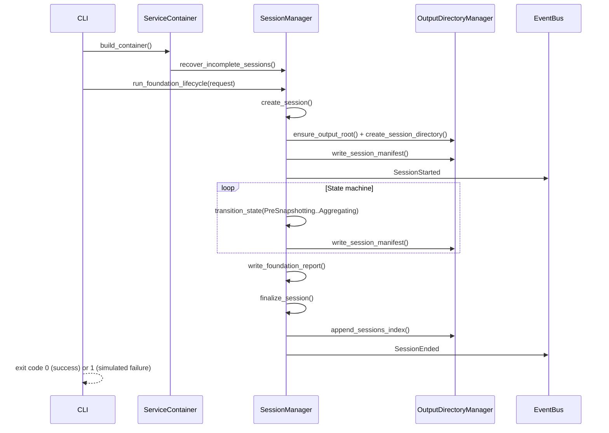

# Foundation Milestone — Example Execution Flow

This flow exercises **Milestone 1 foundation** components only (no collectors, no installer launch).

## Prerequisites

- Python 3.11+
- Virtual environment with dependencies installed

```powershell
cd smartinstaller_AI
python -m venv .venv
.\.venv\Scripts\Activate.ps1
pip install -r requirements.txt
pip install -e .
```

## Step 1 — Recover incomplete sessions (optional)

```powershell
python -m smartinstall --recover-only --config config\smartinstall.config.json
```

**Behavior:** Scans the configured `outputRoot` for `session.json` files whose `sessionStatus` is not terminal and marks them `Incomplete` (REL-02).

## Step 2 — Run foundation demo lifecycle

```powershell
python -m smartinstall --foundation-demo `
  --config config\smartinstall.config.json `
  --product-name "Contoso Widget" `
  --tag "JIRA-1234" `
  C:\Temp\setup.exe
```

If `C:\Temp\setup.exe` does not exist, create it first or omit the path (a demo file is created automatically).

**Internal flow:**



## Step 3 — Inspect artifacts

After a successful demo, under `artifacts\sessions\<SessionId>\`:

| File | Purpose |
|------|---------|
| `session.json` | Session metadata and final status |
| `consolidated_report.json` | Foundation placeholder report (empty collector arrays) |

Global index: `artifacts\sessions_index.json` (sibling of `sessions` folder when using demo output path).

## Step 4 — Simulate failed install exit code

```powershell
python -m smartinstall --foundation-demo --simulate-exit-code 1603 C:\Temp\setup.exe
```

Agent process exit code: **1** (installation failed). Session `installationOutcome`: **Failure**.
