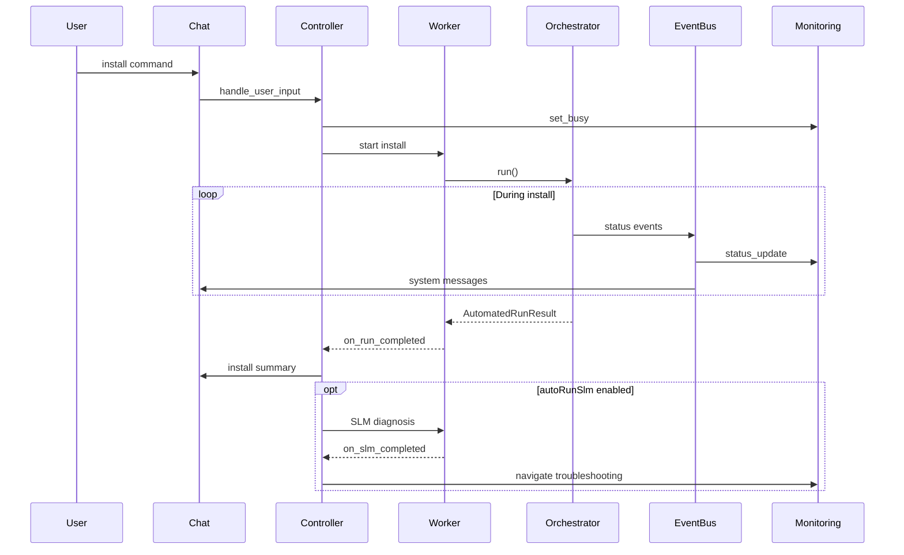

# Installation Flow Specifications

## Overview

End-to-end monitored installation triggered from chat, sidebar, or dashboard.

## Flow Diagram

## Phases

### 1. Intake
- User selects installer (by name or file picker)
- Controller validates installer exists
- InstallWorkflowWorker created

### 2. Pre-Install Snapshot
- Registry, filesystem, process baseline captured
- Status updates streamed to monitoring

### 3. Execution
- Installer launched with elevation if required
- Live process and log monitoring
- Event collectors active (WER, MSI, event log)

### 4. Post-Install Snapshot
- Delta comparison against baseline
- Failure detection and error aggregation

### 5. Report Generation
- Unified JSON report written to `reports/`
- Session artifacts in `sessions/`

### 6. UI Update
- Chat: formatted install summary
- Monitoring: success/error visualization
- Dashboard: stats refresh

### 7. Optional SLM Diagnosis
- If `autoRunSlm` enabled and errors detected
- RAG retrieval from `rag_docs/`
- Ollama inference
- Troubleshooting page populated
- Chat: diagnosis message with sections

## Entry Points

| Source | Action |
|--------|--------|
| Chat | `install`, `install <name>`, `browse` |
| Sidebar | Launch installation, Browse installer |
| Dashboard | Launch installation, Browse installer |
| CLI | `python app.py run --installer <name>` |

## Outcomes

| Outcome | Monitoring | Troubleshooting |
|---------|------------|-----------------|
| success | Green success state | Optional SLM if configured |
| failed | Red error state | Error cards + SLM diagnosis |
| partial | Warning state | Partial error display |
